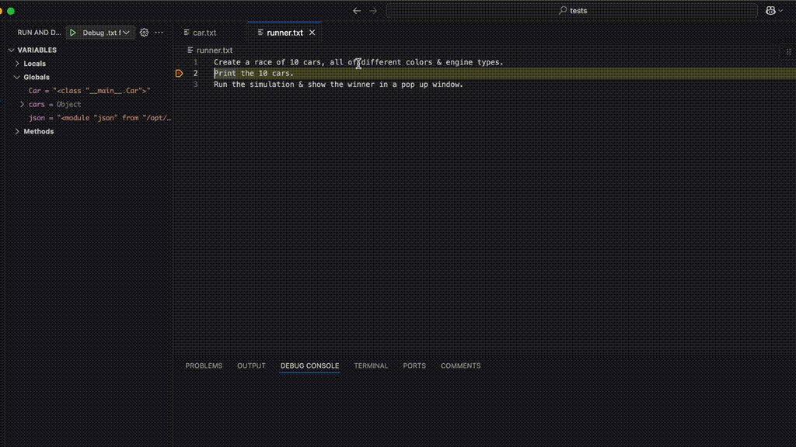

This extension turns `.txt` files into fully executable & debuggable programs. Users can specify their programs with English language, organize the logic across different files if desired
& set breakpoints in the text just like they are used to.

# Features
* Specify program behavior in human language. 
* Specify logic across different `.txt` files that can be reused & imported.
* Debug raw text: set breakpoints and look at variables values.

# Usage
1. Search for `condor` in the VSCode Extension Marketplace & install it.
2. (Temporary) Note the extension requires the `github-copilot` extension to also be installed.
3. Define your program across `.txt` files and execute/debug them!

# Ideas or Feedback?

Please don't hesitate to reach out to the [condor-extension](mailto:clarkedev155@gmail.com) team with feature requests or ideas.
